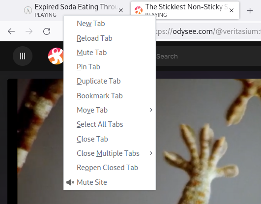

# Mute Site
This is a Firefox extension that allows to instantly mute/unmute all tabs from a website. The mute button appears when a tab is playing audio. When pressed it will toggle mute on all tabs from that domain.

Available here: https://addons.mozilla.org/firefox/addon/mute-site/

Icons come from [Font Awesome](https://fontawesome.com) - CC BY 4.0 license.
